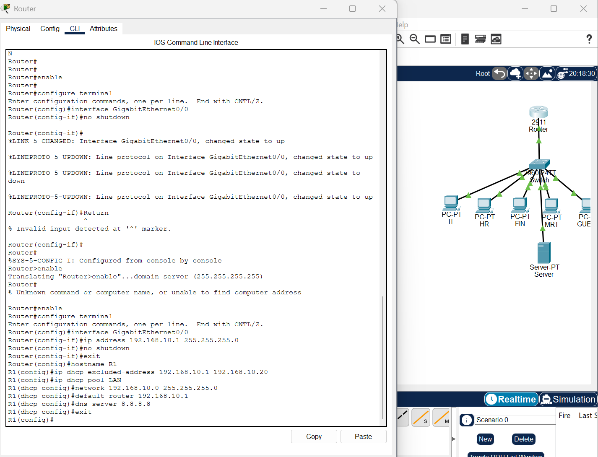
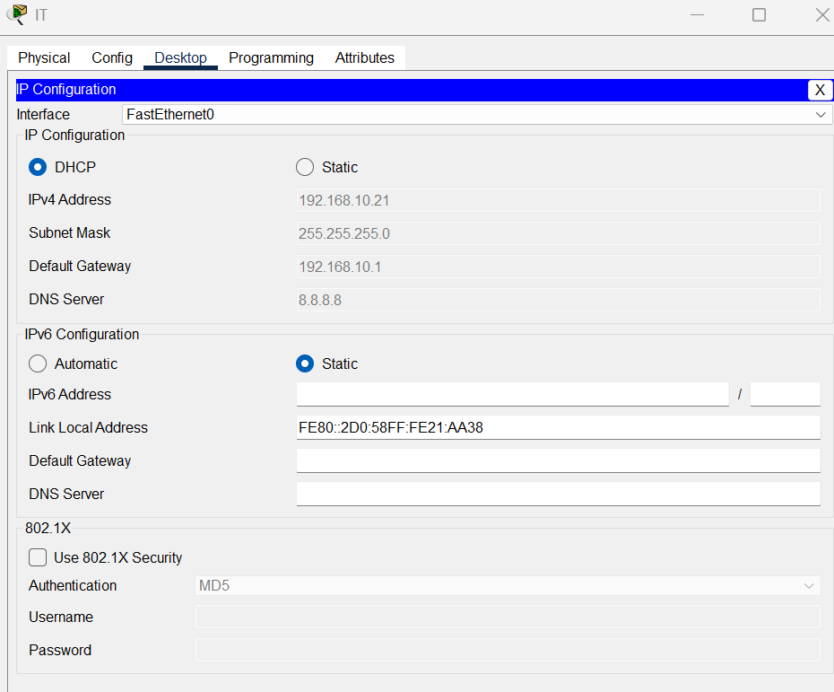
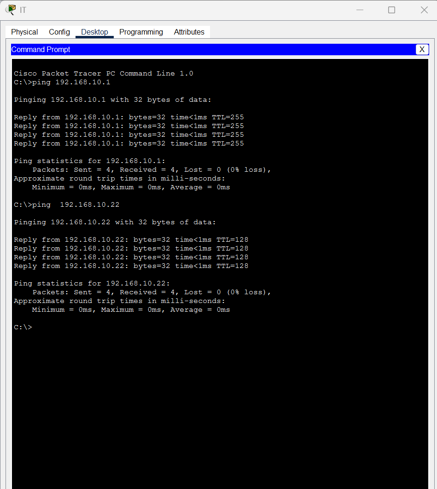
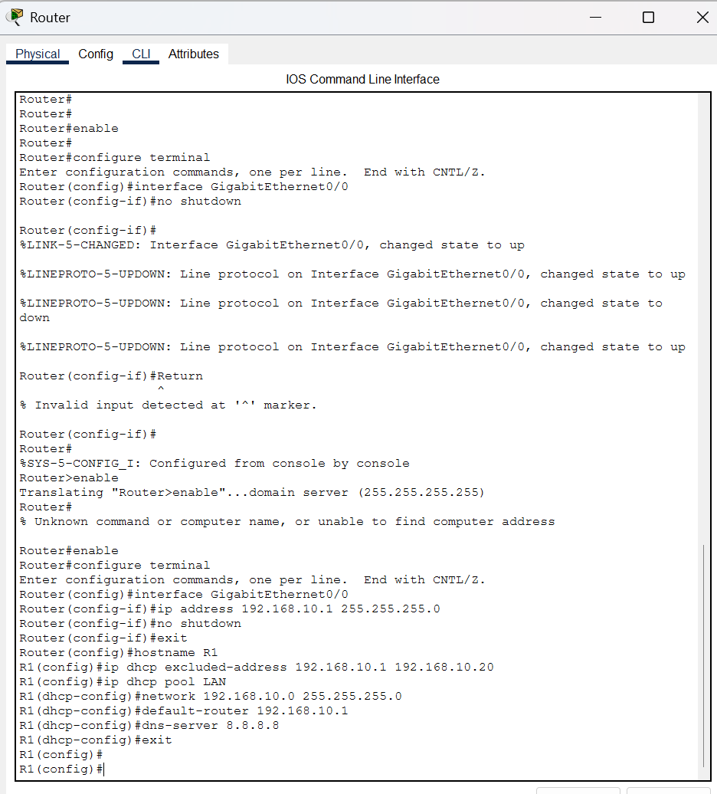

# Cisco Packet Tracer Lab 2 — Router Configuration & DHCP

## 📌 Overview

This lab demonstrates the configuration of a Cisco router to provide **IP addressing and DHCP services** to devices on a local network.

The objective was to configure a Cisco 2911 router, create a DHCP pool, automatically assign IP addresses to client devices, and verify network connectivity using `ping` and Cisco IOS commands.

This project was completed using **Cisco Packet Tracer**.

---

## 🎯 Objectives

* Configure a Cisco router interface
* Assign a static IP address to the router
* Enable the router interface
* Configure a DHCP pool
* Reserve specific IP addresses using DHCP exclusions
* Automatically assign IP addresses to PCs
* Configure DNS and default gateway information through DHCP
* Test connectivity between network devices
* Verify DHCP leases using Cisco IOS commands

---

## 🖥️ Network Topology

### Devices Used

| Device               | Quantity |
| -------------------- | -------: |
| Cisco 2911 Router    |        1 |
| Cisco 2960 Switch    |        1 |
| PCs                  |        6 |
| Server               |        1 |
| Ethernet Connections |        8 |

### Network Configuration

| Setting             | Configuration                    |
| ------------------- | -------------------------------- |
| Network             | `192.168.10.0/24`                |
| Router IP           | `192.168.10.1`                   |
| Subnet Mask         | `255.255.255.0`                  |
| DHCP Range          | `192.168.10.11 – 192.168.10.254` |
| Default Gateway     | `192.168.10.1`                   |
| DNS Server          | `8.8.8.8`                        |
| DHCP Excluded Range | `192.168.10.1 – 192.168.10.10`   |

---

## 🔧 Router Configuration

The router's GigabitEthernet interface was configured with a static IP address:

```text
enable
configure terminal

interface gigabitEthernet 0/0
ip address 192.168.10.1 255.255.255.0
no shutdown
exit
```

### DHCP Configuration

A DHCP exclusion range was configured to reserve addresses for network infrastructure:

```text
ip dhcp excluded-address 192.168.10.1 192.168.10.10
```

The DHCP pool was then created:

```text
ip dhcp pool LAN
network 192.168.10.0 255.255.255.0
default-router 192.168.10.1
dns-server 8.8.8.8
exit
```

The configuration was saved with:

```text
end
write memory
```

---

## 💻 Client Configuration

The PCs were configured to obtain their network settings automatically.

On each PC:

**Desktop → IP Configuration → DHCP**

The router automatically provided:

* IP address
* Subnet mask
* Default gateway
* DNS server

Example:

```text
IP Address:       192.168.10.11
Subnet Mask:      255.255.255.0
Default Gateway:  192.168.10.1
DNS Server:       8.8.8.8
```

The exact IP address assigned to each PC may vary depending on DHCP allocation order.

---

## 🧪 Connectivity Testing

### Check PC Network Configuration

The following command was used to verify the IP configuration:

```text
ipconfig
```

### Test Router Connectivity

From a PC:

```text
ping 192.168.10.1
```

Expected result:

```text
Reply from 192.168.10.1
```

### Test Device-to-Device Connectivity

A ping was also performed between client PCs to verify communication across the LAN.

Example:

```text
ping 192.168.10.12
```

Successful replies confirmed that the devices could communicate across the network.

---

## 🔍 Verify DHCP Assignments

The router's DHCP bindings were checked using:

```text
show ip dhcp binding
```

This command displays the IP addresses that have been dynamically assigned to client devices.

Example:

```text
IP address       Client-ID
192.168.10.11    ...
192.168.10.12    ...
192.168.10.13    ...
```

---

## 📸 Screenshots

The `screenshots` folder contains evidence of the configuration and testing performed during the lab.

```text
screenshots/
├── 06-router-dhcp-config.png
├── 07-pc-dhcp-ip.png
├── 08-ping-test.png
└── 09-dhcp-bindings.png
```

### Router DHCP Configuration



### PC DHCP Configuration



### Connectivity Test



### DHCP Bindings



---

## 📁 Project Files

```text
Cisco-Packet-Tracer-Lab-2/
│
├── screenshots/
│   ├── 06-router-dhcp-config.png
│   ├── 07-pc-dhcp-ip.png
│   ├── 08-ping-test.png
│   └── 09-dhcp-bindings.png
│
├── Lab-2-Router-DHCP.pkt
└── README.md
```

---

## 🧠 Skills Demonstrated

* Cisco Packet Tracer
* Cisco IOS CLI
* Router configuration
* IPv4 addressing
* Subnetting
* DHCP configuration
* DHCP address allocation
* Default gateway configuration
* DNS configuration
* Network troubleshooting
* `ping` testing
* `ipconfig`
* `show ip dhcp binding`
* Basic LAN networking

---

## ✅ Outcome

The lab successfully demonstrated a functional LAN in which the Cisco router provided DHCP services to client devices.

The PCs automatically received valid IPv4 configuration information and were able to communicate with the router and other devices on the network.

This lab provided practical experience with **basic Cisco router configuration, DHCP, IP addressing, and network troubleshooting**.

---

## 🚀 Next Lab

**Lab 3 — Cisco Switch Configuration & MAC Address Table**

Planned topics:

* Switch CLI configuration
* Hostname configuration
* Console and privileged-mode security
* VLAN basics
* MAC address table
* Port configuration
* Connectivity testing
* Basic switch troubleshooting
